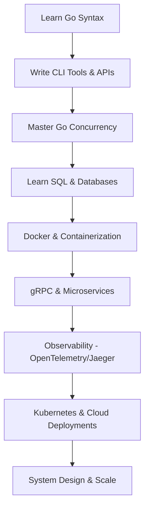

# 🗺️ The "Beyond Go" Roadmap: Leveling Up to Backend Boss

So, you've mastered Go. You know pointers, you spin up goroutines like a pro, and you handle errors like a responsible adult. What's next? 

Go is the language of the **Cloud and Modern Infrastructure**. If you look at the CNCF (Cloud Native Computing Foundation) landscape, almost every major tool—Kubernetes, Docker, Prometheus, Terraform, Jaeger, Hugo—is written in Go.

Here is your roadmap to conquering the backend ecosystem, explained simply and without the boring stuff.

---

## 🛞 1. gRPC & Protocol Buffers (JSON's Athletic Cousin)
*   **What it is:** JSON is great, but it's text-based and slow for internal server-to-server communication. gRPC lets servers talk to each other in binary (using Protocol Buffers) at lightning-fast speeds.
*   **Analogy:** JSON is like sending letters written in calligraphy. gRPC is like sending messages in Morse code—super fast, compact, and efficient.
*   **Why care:** Every modern microservice system (including Jaeger and Kubernetes internal services) uses gRPC to communicate.
*   **Things to learn:** Proto file syntax, generating Go code from proto files, Unary vs. Streaming RPCs.

---

## 📦 2. Docker & Containerization (The "It Works on My Machine" Cure)
*   **What it is:** Packaging your Go application along with its environment so it runs exactly the same way on your laptop, your friend's laptop, and AWS.
*   **Analogy:** Imagine shipping a cake. Instead of carrying it loose in a bag, you put it in a hard cardboard shipping box. The box fits perfectly on any cargo ship. That box is a **Container**.
*   **Why care:** You will never deploy raw files directly to servers anymore. You will containerize your Go binaries.
*   **Things to learn:** Writing clean `Dockerfiles` (multi-stage builds to keep your Go image size under 15MB!), running containers, managing ports.

---

## 🏗️ 3. Kubernetes (K8s) (The Container Fleet Admiral)
*   **What it is:** If you have 1 Docker container, you can manage it easily. If you have 500 containers running across 20 servers, you need an automated manager. That's Kubernetes.
*   **Analogy:** Docker containers are shipping containers. Kubernetes is the massive port crane and captain that decides where to stack them, moves them if they break, and scales them up when traffic hits.
*   **Why care:** Kubernetes is written entirely in Go! If you want to contribute to the core of Kubernetes or write custom K8s Operators, knowing Go is your superpower.
*   **Things to learn:** Pods, Deployments, Services, ConfigMaps, and local setups like Minikube or Kind.

---

## 🔍 4. Observability (CCTV for Your Code)
*   **What it is:** Knowing what your code is doing *after* it's deployed. If a user complains "the app is slow", how do you find out why? You use **Logs, Metrics, and Traces**.
*   **The Big Three:**
    1.  **Logs:** "App started", "User logged in", "Database connection failed".
    2.  **Metrics:** "CPU usage is 85%", "Request speed is 200ms".
    3.  **Traces (Jaeger / OpenTelemetry):** Tracing a single user click as it hops through 5 different microservices, showing you exactly which database query took 4 seconds.
*   **Why care:** Since you've worked on Jaeger UI before, learning how Jaeger instrumentation works in Go will make you a total badass. You'll understand how telemetry data is generated and collected.
*   **Things to learn:** OpenTelemetry Go SDK, Jaeger backend structure, Prometheus metrics.

---

## 💾 5. Databases & Caching (Where to Hide Your Data)
*   **What it is:** Moving beyond saving things in memory. You need persistence (SQL/NoSQL) and speed (Caching).
*   **The Tech Stack:**
    *   **PostgreSQL:** The gold standard for relational data.
    *   **Redis:** An in-memory database used for caching. It's like keeping your most used files on your desk instead of walking to the filing cabinet (Postgres) every time.
    *   **GORM or sqlx:** Go libraries to interact with databases without writing raw SQL strings every single time (though knowing raw SQL is a must!).
*   **Things to learn:** Database migrations, connection pooling in Go, caching strategies.

---

## 🛡️ 6. System Design (Thinking Like an Architect)
*   **What it is:** Designing systems that don't fall over when 1 million users visit at the same time.
*   **Topics to explore:**
    *   **Load Balancers:** Distributing traffic across multiple server instances so no single server gets overwhelmed.
    *   **Message Queues (Kafka / RabbitMQ):** Letting servers communicate asynchronously. (e.g., "Hey Email Service, send a welcome email when you have a free second, I'm not going to wait for you").
    *   **Rate Limiting:** Stopping bad actors (or scripts) from spamming your API.

---

## 🧭 Your Path Ahead

Don't worry about this list yet! This is a roadmap for the next 6 to 12 months. First, let's nail Go syntax and core concepts. One step at a time! 

Whenever you are ready to begin, head over to `go_syllabus_detailed.md` and type **"Let's start Step 1.1!"**
