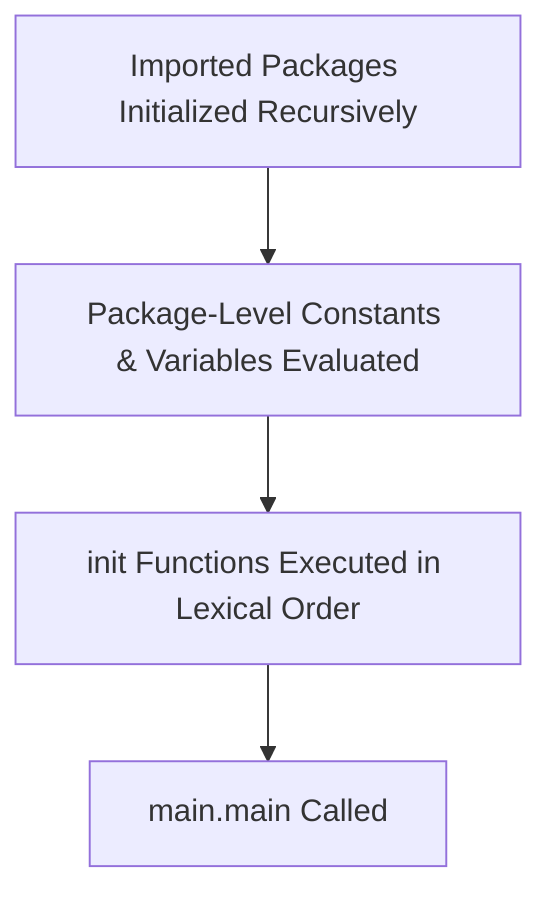

# Step 1.1: Hello World, Syntax Structure & Go Modules 🚀

Welcome to Step 1.1. In this step, we analyze the structure of a basic Go program, the source compilation requirements, package initialization order, and the Go module dependency system.

Official documentation:
*   [The Go Programming Language Specification: Program Execution](https://golang.org/ref/spec#Program_execution)
*   [How to Write Go Code (Modules)](https://go.dev/doc/code)
*   [The Go Blog: Organize Your Code](https://go.dev/doc/effective_go#names)

---

## 🔍 Deep Dive 1: Source File Encoding and Lexical Elements

Go source files are defined by the official specification as sequences of Unicode characters encoded in **UTF-8**. 

### 1. Semicolon Injection Rule
If you look at Go code, you will notice the absence of semicolons at the end of statements (unlike C, C++, or Java). However, the Go formal grammar *does* use semicolons to terminate statements. 
To achieve clean syntax, the Go lexer automatically injects semicolons at the end of a line if the line's final token is:
*   An identifier (e.g., a variable or function name).
*   A basic literal (such as a string, integer, or float).
*   One of the keywords: `break`, `continue`, `fallthrough`, or `return`.
*   One of the operators and punctuation: `++`, `--`, `)`, `]`, or `}`.

**Gotcha (Opening Braces)**: Because of this rule, you cannot place the opening brace of a control block or function on a new line:
```go
// This will result in a compile error because a semicolon is injected after main()
func main() 
{ // ❌ Syntax error: unexpected semicolon or newline before {
}

// This compiles successfully
func main() { // ✅ Correct
}
```

### 2. Package Scoping & Directory Structure
Every Go source file must begin with a package clause:
```go
package <name>
```
*   The package name determines the default identifier for importing packages.
*   By convention, all files in the same directory must belong to the **same package**.
*   The `main` package is special: it defines an executable program rather than a shared library.

---

## 🔍 Deep Dive 2: Package Initialization and Execution Order

Understanding how Go initializes program state before executing `main()` is critical for debugging bootstrap configurations.



1.  **Dependency Initialization**: If the `main` package imports package `A`, and package `A` imports package `B`, Go initializes them recursively starting at the leaf nodes (Package `B` first, then `A`, then `main`).
2.  **Package-Level Variables**: Within a package, package-level variables are initialized first. If variables have dependencies on each other, they are evaluated in their dependency order.
3.  **The `init` Function**: After all variables are initialized, any functions named `init()` defined in the package are executed.
    *   `init` functions take no arguments and return no values.
    *   A single package/file can have **multiple** `init` functions. They are executed in the order they are presented to the compiler (typically lexical order by file name).
    *   You cannot call `init()` explicitly in your code; it is invoked solely by the Go runtime.
4.  **Entry Point**: Once all imported packages and the `main` package are fully initialized, the runtime calls `main.main()`. Program execution terminates when `main.main` returns or is aborted.

---

## 🛠️ Go Modules Under the Hood

A Go module is a collection of Go packages stored in a file tree with a `go.mod` file at its root. 

*   **`go.mod`**: Defines the module's import path, minimum Go version compatibility, and explicit dependency requirements (using semantic versioning, e.g., `v1.2.3`).
*   **`go.sum`**: Contains cryptographic hashes of the specific versions of dependencies downloaded for the module. This is used by the Go toolchain to verify that future downloads of these dependencies match the exact content of the initial download, preventing security attacks (such as dependency hijacking).

---

## ⚠️ Common Gotchas

1.  **Unused Imports and Variables**: In Go, importing a package or declaring a local variable without using it is a compiler error. This enforces a clean dependency graph and prevents memory bloat. You can use the blank identifier `_` to suppress errors for imported packages that are required for their side-effects (like calling their `init` functions).
2.  **Mismatched Directory and Package Names**: While the package name inside the source file does not strictly need to match the directory name, it is a highly recommended convention. The only exception is the `main` package, which is frequently contained in directories named after the application.

---

## 🎯 Practice Challenge
Open [practice.go](./practice.go) and verify that you have implemented the details correctly, then run the code using:
```bash
go run .
```
Verify that the output matches your expectations.
