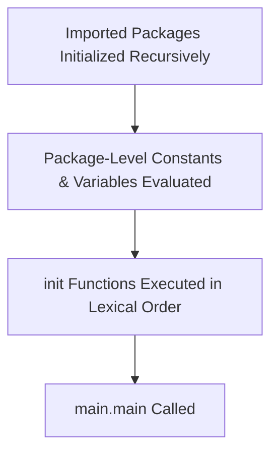

# Step 1.1: Hello World, Syntax Structure & Go Modules 🚀

Welcome to Step 1.1, bhava! In this step, we analyze the structure of a basic Go program, the source compilation requirements, package initialization order, and the Go module dependency system.

To keep it interesting, we will use some local flavor and the classic **Dulha (Groom)** analogy to explain why certain files are special in Go.

Official documentation:
*   [The Go Spec: Program Execution](https://golang.org/ref/spec#Program_execution)
*   [How to Write Go Code (Modules)](https://go.dev/doc/code)
*   [The Go Blog: Organize Your Code](https://go.dev/doc/effective_go#names)

---

## 💍 The "Dulha" (Groom) Analogy for executable entry points

Why are `package main` and `func main` so special in Go? 

Think of a wedding (executing a program):
*   You can invite 100 relatives (other files/packages like `helper.go` or `utils`), decorate the venue, and buy premium gifts.
*   But without the **Dulha (Groom)**, the wedding cannot happen!
*   In Go, **`package main`** is the wedding hall, and **`func main()`** is the **Dulha**. 
*   If your code doesn't have a `package main` with a `func main()`, the compiler will say: "Whoa, who is the groom here? I cannot build an executable binary!" It will only build a shared library.

---

## 🔍 Deep Dive 1: Source File Encoding and Lexical Elements

Go source files are defined by the official specification as sequences of Unicode characters encoded in **UTF-8**. 

### 1. Semicolon Injection Rule
If you look at Go code, you will notice the absence of semicolons at the end of statements. However, the Go formal grammar *does* use semicolons to terminate statements.
To achieve clean syntax, the Go lexer automatically injects semicolons at the end of a line if the line's final token is:
*   An identifier (e.g., a variable or function name).
*   A basic literal (such as a string, integer, or float).
*   One of the keywords: `break`, `continue`, `fallthrough`, or `return`.
*   One of the operators and punctuation: `++`, `--`, `)`, `]`, or `}`.

**Gotcha (Opening Braces)**: Because of this rule, you cannot place the opening brace of a control block or function on a new line:
```go
// This will fail because the compiler injects a semicolon after main()!
func main() 
{ // ❌ Syntax error: unexpected semicolon or newline before {
}

// This compiles successfully
func main() { // ✅ Correct
}
```

---

## 🔍 Deep Dive 2: Package Initialization and Execution Order

Understanding how Go initializes program state before executing `main()` is critical.



1.  **Dependency Initialization**: If the `main` package imports package `A`, and package `A` imports package `B`, Go initializes them recursively starting at the leaf nodes (Package `B` first, then `A`, then `main`).
2.  **Package-Level Variables**: Within a package, package-level variables are initialized first. If variables have dependencies on each other, they are evaluated in their dependency order.
3.  **The `init` Function**: After all variables are initialized, any functions named `init()` defined in the package are executed.
    *   `init` functions take no arguments and return no values.
    *   A single package/file can have **multiple** `init` functions. They are executed in the order they are presented to the compiler.
    *   You cannot call `init()` explicitly; it is invoked solely by the Go runtime.
4.  **Entry Point**: Once all imported packages and the `main` package are fully initialized, the runtime calls `main.main()`. Program execution terminates when `main.main` returns.

---

## 🛠️ Go Modules Under the Hood

A Go module is a collection of Go packages stored in a file tree with a `go.mod` file at its root.

*   **`go.mod`**: Defines the module's import path, minimum Go version compatibility, and explicit dependency requirements (using semantic versioning).
*   **`go.sum`**: Contains cryptographic hashes of the specific versions of dependencies downloaded for the module. This is used by the Go toolchain to verify that future downloads of these dependencies match the exact content of the initial download, preventing dependency hijacking.

---

## 👑 Marathi Swag: Chala Suru Karu Ya!
*   **Chala bhava!** (Let's go brother!) Go coding is **lai bhari** (awesome) because it doesn't have the useless syntax drama of other languages.
*   Remember: `package main` is the **Dulha** (Groom). If he doesn't show up, the whole event is **fail**!
*   To run your code, just run `go run .` in your terminal and say: **"Ganpati Bappa Morya!"**
*   Open [practice.go](./practice.go) to complete the challenge!
