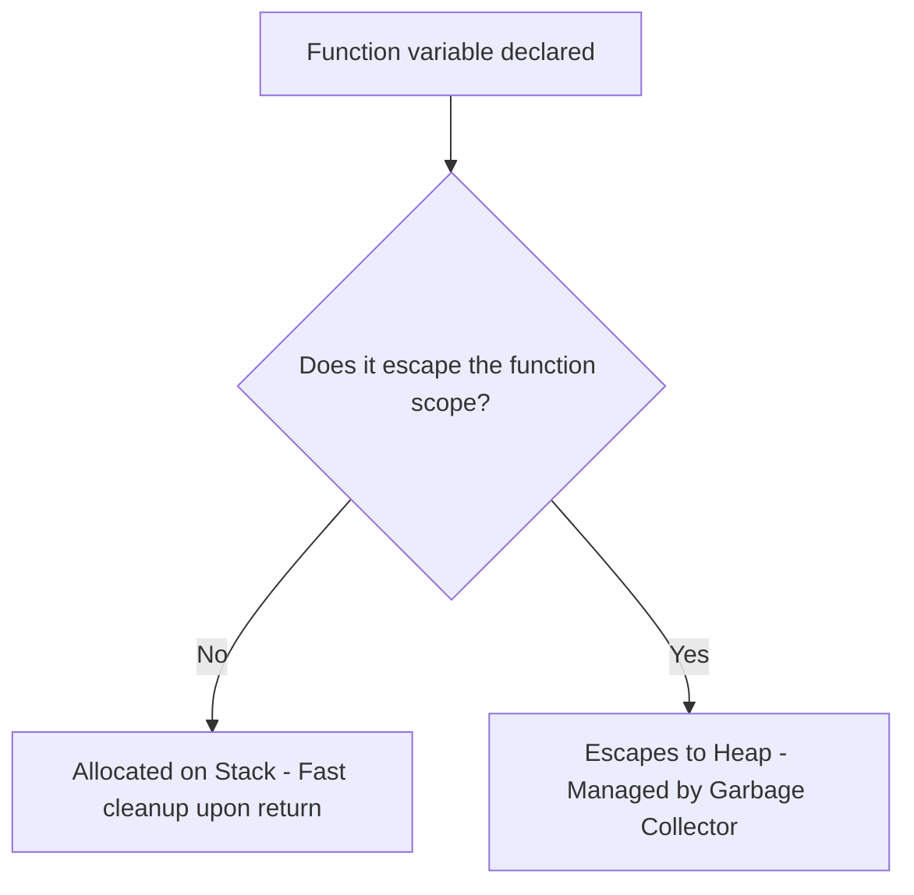

# Step 1.5: Pointers, Memory Addressability & Escape Analysis 📍

This step focuses on pointers, how Go handles memory allocation (Stack vs. Heap), escape analysis runtime optimizations, and pointer safety rules.

Official documentation:
*   [Go Spec: Pointer Types](https://golang.org/ref/spec#Pointer_types)
*   [Go Spec: Address Operators](https://golang.org/ref/spec#Address_operators)
*   [Go Spec: Allocation](https://golang.org/ref/spec#Allocation)
*   [Go Compiler Internals: Escape Analysis](https://go.dev/doc/faq#stack_or_heap)

---

## 🔍 Deep Dive 1: Pointer Mechanics & Notation

Every value in Go is stored at a memory address. A pointer holds the memory address of a value.
*   **`*T`**: Denotes a pointer to a value of type `T`.
*   **`&` (Address-of Operator)**: Generates a pointer to its operand. It can only be applied to addressable values (variables, slice elements, struct fields). It *cannot* be applied to constants, maps, or functions directly.
*   **`*` (Dereference Operator)**: Accesses the value of the memory address pointing to by the pointer.
```go
var x int = 42
var p *int = &x // p holds the memory address of x
fmt.Println(*p) // Dereferencing prints 42
*p = 100        // Modifies the value at address p
fmt.Println(x)  // prints 100
```

---

## 🔍 Deep Dive 2: Safety Rules & Pointer Arithmetic Restrictions

Unlike C and C++, Go is a memory-safe language. By default, **Go does not allow pointer arithmetic**.
```go
p := &x
// p = p + 1 // ❌ Compile error: invalid operation (operator + not defined on pointer)
```
This restriction prevents class-wide memory corruption bugs (like buffer overflows and writing to arbitrary memory boundaries).

### The `unsafe` Package
If pointer arithmetic is absolutely necessary (e.g., writing low-level system drivers or performance-critical bindings), Go provides the `unsafe` package. This bypasses the compiler's type safety checks and allows direct memory arithmetic using `unsafe.Pointer` and `uintptr`:
```go
import "unsafe"

// Warning: Not recommended for general production code!
ptr := unsafe.Pointer(&array[0])
nextElementPtr := (*int)(unsafe.Pointer(uintptr(ptr) + unsafe.Sizeof(array[0])))
```

---

## 🔍 Deep Dive 3: Allocating Memory (`new()` vs. Composite Literals)

Go provides two primary ways to allocate memory for types:

### 1. The `new()` Built-in Function
`new(T)` allocates zeroed storage for a new item of type `T` and returns its address (a value of type `*T`).
```go
p := new(int) // p is of type *int, pointing to a value initialized to 0
```
### 2. Composite Literals
For structs, composite literals are generally preferred over `new()` because they allow you to initialize field values simultaneously:
```go
type User struct { Name string }

u1 := new(User) // Returns *User pointing to User{Name: ""}
u2 := &User{Name: "Shubham"} // Also returns *User, but initialized!
```

---

## 🔍 Deep Dive 4: Stack vs. Heap Allocation (Escape Analysis)

In older languages like C, developers had to manually decide where to allocate memory (Stack for local, Heap via `malloc` for persistent). In Go, the programmer does not choose. The compiler decides where to allocate memory via a process called **Escape Analysis**.



### Allocation Rules
1.  **Stack Allocation**: If the compiler can prove that a variable does not outlive the stack frame of the function it is declared in, it allocates it on the **Stack**. Stack allocation is extremely fast and is automatically cleaned up when the function returns.
2.  **Heap Allocation**: If the variable's lifecycle escapes the function scope (e.g., returned as a pointer from a function, stored in a global variable, or sent through a channel), the variable **escapes to the heap**. Heap memory is managed and periodically swept by the Garbage Collector.

### Verifying Escape Analysis
You can inspect the compiler's allocation decisions by passing the `-gcflags="-m"` flag to the build tool:
```bash
go build -gcflags="-m" main.go
```
Expected compiler output:
```text
./main.go:10:9: &x escapes to heap
./main.go:8:6: moved to heap: x
```

---

## ⚠️ Common Gotchas

1.  **Dereferencing a `nil` Pointer**: A pointer that does not point to a valid address is initialized to `nil`. Trying to dereference a `nil` pointer results in a runtime panic (similar to NullPointerException):
    ```go
    var p *int // p is nil
    // *p = 10 // ❌ RUNTIME PANIC: panic: runtime error: invalid memory address or nil pointer dereference
    ```
    **Prevention**: Always perform a nil check if a pointer's origin is unsafe:
    ```go
    if p != nil {
        *p = 10
    }
    ```

---

## 🎯 Practice Challenge
Open [practice.go](./practice.go) and implement the pointer challenges. Run:
```bash
go run .
```
Verify compilation.
