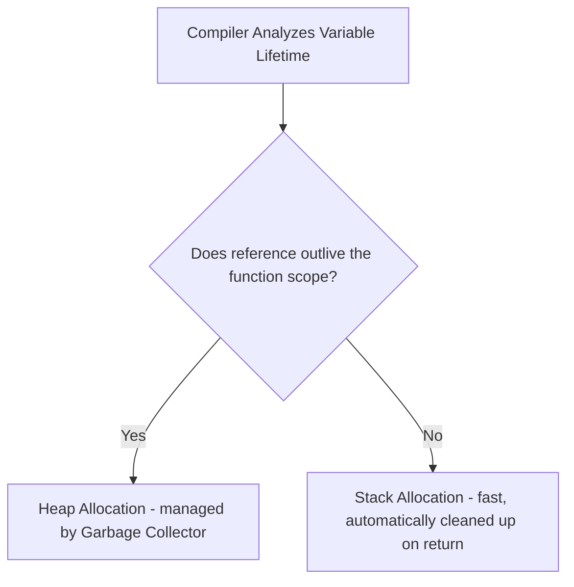

# Step 1.5: Pointers, Memory Addressability & Escape Analysis 📍

This step covers the mechanics of memory addresses, pointer allocation safety, and how the Go compiler uses Escape Analysis to decide whether a variable lives on the CPU Stack or the System Heap.

We will learn this with systems-level precision, but with the classic **Google Maps / Misal Pav Location** analogy!

Official documentation:
*   [Go Spec: Pointer types](https://golang.org/ref/spec#Pointer_types)
*   [Go Spec: Address operators](https://golang.org/ref/spec#Address_operators)
*   [Go FAQ: How do I know whether a variable is allocated in the heap or on the stack?](https://go.dev/doc/faq#stack_or_heap)

---

## 🗺️ The Google Maps / Misal Pav Location Analogy

Pointers can be intimidating, but they are just addresses.

### The Analogy:
*   Imagine you eat a legendary **Misal Pav** at a local hotel in Pune/Mumbai. Your friend wants to eat there too.
*   You don't pick up the entire hotel building and carry it to your friend's house!
*   Instead, you open WhatsApp and send them the **Google Maps location (the Address)** of the hotel.
*   That address is a **Pointer**.
    *   **`&` (WhatsApp Location Share)**: Gets the memory address of where the data is stored.
    *   **`*` (Clicking Navigating to the Location)**: Dereferences the address to look inside and read or modify the actual data at that spot.

---

## 🔍 Deep Dive 1: Pointer Basics & Memory Constraints

A pointer variable stores the memory address of another value.

```go
var x int = 42
var p *int = &x // p now stores the memory address of x

fmt.Println(p)  // Prints address (e.g. 0xc0000140a8)
fmt.Println(*p) // Prints 42 (dereferenced value)
```

### Safety Constraints (No Pointer Arithmetic)
Unlike C or C++, Go does not allow pointer arithmetic by default:
```go
// p = p + 1 // ❌ Compile error: invalid operation (cannot add to pointer)
```
This is a conscious design decision to prevent memory corruption and buffer-overflow security vulnerabilities. If pointer arithmetic is absolutely required for performance or systems integrations, it must be performed using the `unsafe` package.

---

## 🔍 Deep Dive 2: `new()` vs. Composite Literals

Go provides two ways to allocate memory:

### 1. The `new(T)` built-in function
`new(T)` allocates zeroed storage for a type `T` at runtime and returns a pointer to it (`*T`).
```go
ptr := new(int) // ptr is of type *int, pointing to a value initialized to 0
```

### 2. Composite Literals (Preferred)
You can allocate and initialize values using composite literals and take their address directly using `&`:
```go
type User struct { Name string }
u := &User{Name: "Shubham"} // Allocates User, initializes Name, returns *User
```
**Best Practice**: Use composite literals instead of `new()` because they allow you to initialize fields directly, resulting in cleaner and more expressive code.

---

## 🔍 Deep Dive 3: Compiler Escape Analysis

Unlike C (where the programmer manually allocates heap memory via `malloc`), or Java (where objects are always on the heap), Go's compiler decides where variables are stored using **Escape Analysis**.



### How Escape Analysis works:
*   **Stack Allocation**: Fast. Stacks are automatically cleaned up when the function returns.
*   **Heap Allocation**: Slower. Requires garbage collector management.
*   If the compiler determines that a variable's reference outlives the function that declared it (e.g., returning a pointer to a local variable), the variable **escapes to the heap**:
    ```go
    func GetPointer() *int {
        x := 42
        return &x // x escapes to the heap because its pointer is returned to the caller!
    }
    ```

### Inspecting Escape Decisions
You can view the compiler's escape decisions by passing optimization flags to `go build`:
```bash
go build -gcflags="-m"
```
Expected output showing escape metrics:
```text
.\main.go:8:2: moved to heap: x
```

---

## 👑 Marathi Swag: WhatsApp Location Pointers!
*   Pointers are nothing but **Google Maps links**. Don't carry the whole building, just pass the address (`&`)!
*   To look inside the address, use the star operator (`*`).
*   No pointer arithmetic: Go prevents you from driving off the road. It keeps your memory safe.
*   **Escape Analysis**: Go compiler is smart. It figures out whether to keep data on the stack or dump it on the heap. You don't have to call `free()` or `delete` manually. **Ekdum tension-free system!**
*   Now, open [practice.go](./practice.go) to complete the pointer swap challenge!
