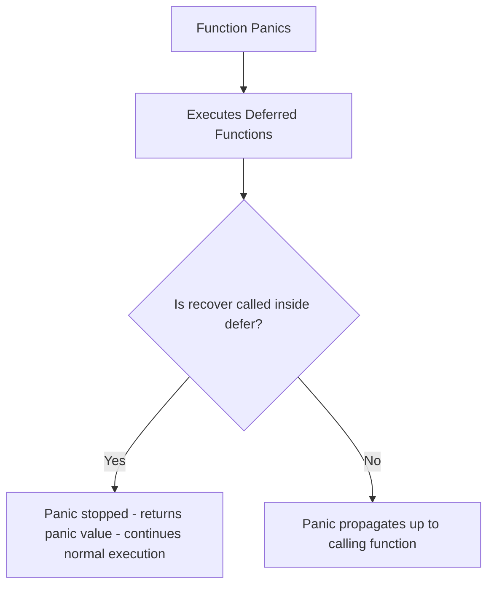

# Step 3.3: Defer, Panic & Recover (Resource Lifecycles & Failure Boundaries) 🧹

This step covers how Go schedules resource cleanup operations using `defer`, panic propagation models, and how to recover from fatal runtime conditions.

Official documentation:
*   [Go Blog: Defer, Panic, and Recover](https://go.dev/blog/defer-panic-and-recover)
*   [Go Spec: Defer statements](https://golang.org/ref/spec#Defer_statements)
*   [Go Spec: Handling Panics](https://golang.org/ref/spec#Handling_panics)

---

## 🔍 Deep Dive 1: The Mechanics of `defer`

A `defer` statement pushes a function call onto a list. The list of saved calls is executed when the surrounding function returns. `defer` is commonly used to guarantee that resources (such as file handlers, network connections, database handles, or mutexes) are closed or released:

```go
func ReadFile(filename string) {
    f, err := os.Open(filename)
    if err != nil {
        return
    }
    defer f.Close() // Guaranteed to run when ReadFile exits
    // ...
}
```

### The Three Rules of `defer`

#### 1. Argument Evaluation Timeline
A deferred function's **arguments are evaluated when the `defer` statement is evaluated**, not when the function is executed:
```go
func printVal(i int) {
    fmt.Println(i)
}
func main() {
    i := 0
    defer printVal(i) // Arguments evaluated here: printVal(0) is queued
    i++
    return // Executing printVal(0) prints 0!
}
```

#### 2. Last-In, First-Out (LIFO) Execution Order
Deferred function calls are executed in **LIFO order** (a stack structure):
```go
func main() {
    defer fmt.Println("first")
    defer fmt.Println("second")
    // Prints "second" then "first"
}
```

#### 3. Mutation of Named Return Values
A deferred function can read and modify the named return variables of the surrounding function before they are returned to the caller:
```go
func addOne() (result int) {
    defer func() {
        result++ // Modifies the return variable after computation
    }()
    return 1 // result is initialized to 1, then incremented to 2!
}
```

---

## 🔍 Deep Dive 2: Panic & Runtime Panics

A **panic** indicates a severe, unrecoverable runtime error (such as a division by zero, index out of bounds, or dereferencing a nil pointer).
*   When a panic occurs, normal function execution stops immediately.
*   Any deferred functions in the current stack frame are executed.
*   The panic then **propagates up the call stack** (executing defers in each calling function) until it reaches the main function.
*   If not caught, the program exits with a non-zero exit code and prints a stack trace.

You can trigger a panic manually using the built-in `panic(v)` function:
```go
panic("unrecoverable configuration error")
```

---

## 🔍 Deep Dive 3: Recovering from Panics (`recover()`)

The built-in `recover()` function allows a program to intercept a propagating panic and resume normal execution.



### Constraints for `recover`
*   `recover()` **only works when called directly inside a deferred function**. Calling `recover()` inside a normal function, or inside a function called by a deferred function, returns `nil` and does not halt panic propagation.
*   If no panic is active, calling `recover()` simply returns `nil`.

```go
func SafeRun() {
    defer func() {
        if r := recover(); r != nil {
            fmt.Println("Recovered from panic:", r)
        }
    }()

    fmt.Println("Starting execution...")
    panic("something went wrong") // Triggers panic
    fmt.Println("This line will never execute!")
}
```

---

## ⚠️ Common Gotchas

1.  **Defer inside Loops**: Placing a `defer` inside a loop can cause resource exhaustion (file descriptor exhaustion) because deferred calls are not executed until the **surrounding function** exits, not the loop block:
    ```go
    for _, file := range files {
        f, _ := os.Open(file)
        defer f.Close() // ⚠️ Danger: Files remain open until the main function returns!
    }
    ```
    **Fix**: Wrap the loop body inside an anonymous helper function, letting the deferred call execute on each iteration:
    ```go
    for _, file := range files {
        func() {
            f, _ := os.Open(file)
            defer f.Close() // Executed immediately when the anonymous function returns
        }()
    }
    ```

---

## 🎯 Practice Challenge
Open [practice.go](./practice.go) and implement safe functions using `defer` and `recover`. Run:
```bash
go run .
```
Verify compilation and runtime panic recovery.
